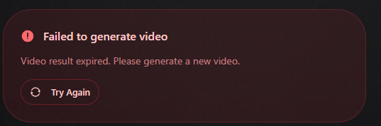

kenapa hasil image yang di generate tidak bisa langsung create video, , [Video] Starting wan/v2.6 generation
[Video] Duration: 5s, Resolution: 720p
[Video] Original prompt: create marketing product of this toy
[Video] Enhanced prompt: create marketing product of this toy, realistic natural movement, continuous smooth motion, complete action from start to finish, high quality, natural lighting
[WAN] Starting image-to-video generation: {
  endpoint: 'fal-ai/wan/v2.6/image-to-video',
  duration: 5,
  resolution: '720p',
  aspectRatio: '16:9'
}
[WAN] Generation queued with request_id: 7cc311cc-9c1f-4ac0-844b-fd1fc07cefa0
[Video] Started async task: 7cc311cc-9c1f-4ac0-844b-fd1fc07cefa0
 POST /api/video-start 200 in 2.4s (compile: 4ms, proxy.ts: 342ms, render: 2.1s)
[WAN] Status check for 7cc311cc-9c1f-4ac0-844b-fd1fc07cefa0: COMPLETED
[Video] Generation completed, fetching result...
[WAN] Result not found for 7cc311cc-9c1f-4ac0-844b-fd1fc07cefa0 - may have expired or already been fetched
[Video] Result already consumed for 7cc311cc-9c1f-4ac0-844b-fd1fc07cefa0, checking database...
 GET /api/video-status?requestId=7cc311cc-9c1f-4ac0-844b-fd1fc07cefa0&type=image2video&generationId=04c8fc8e-95be-406e-9fd3-3c2b3ad6f2f6 200 in 1595ms (compile: 5ms, proxy.ts: 129ms, render: 1460ms)

 tetapi kalo pake veo aman2 aja, itu kenapa yah?

 dan coba analisa keseluruhan apakah aplikasi sudah siap untuk go-live atau belum